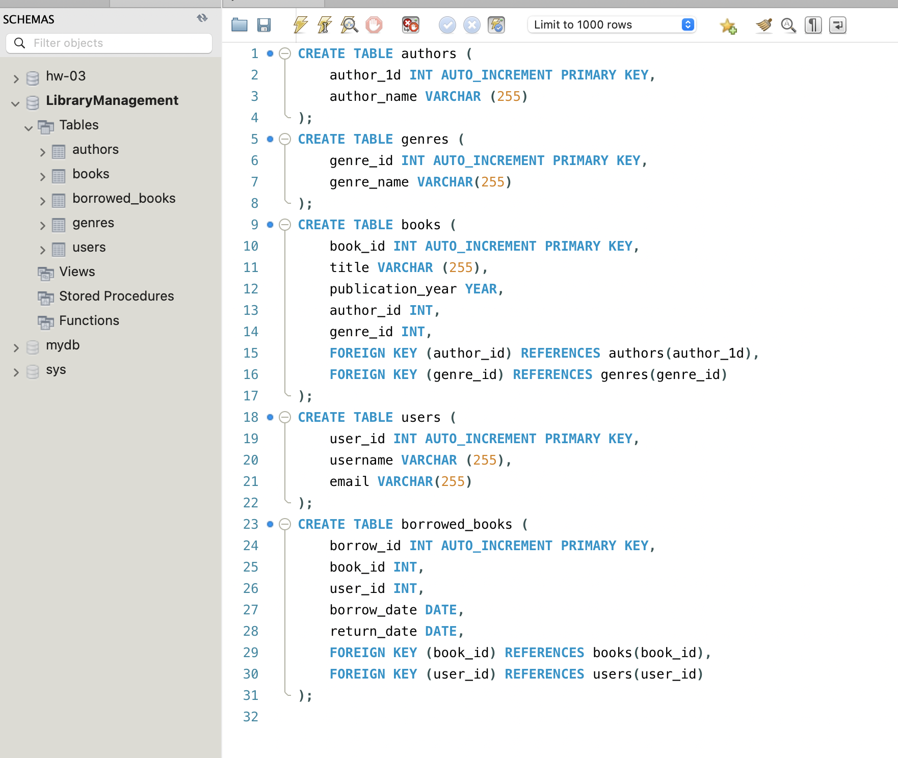
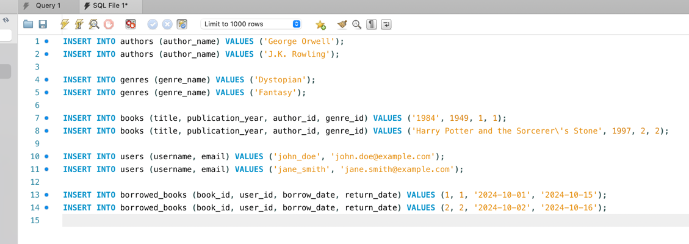
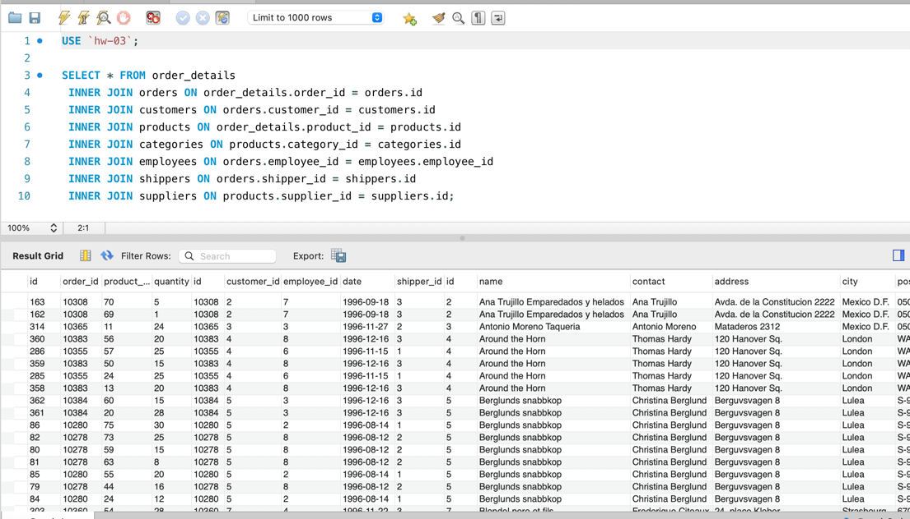
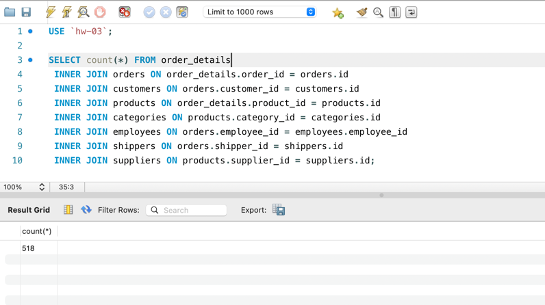
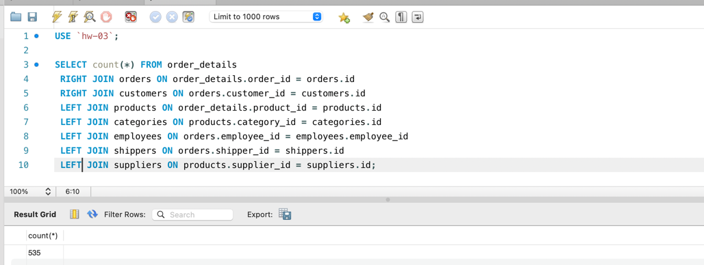
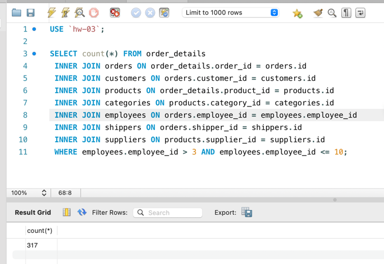
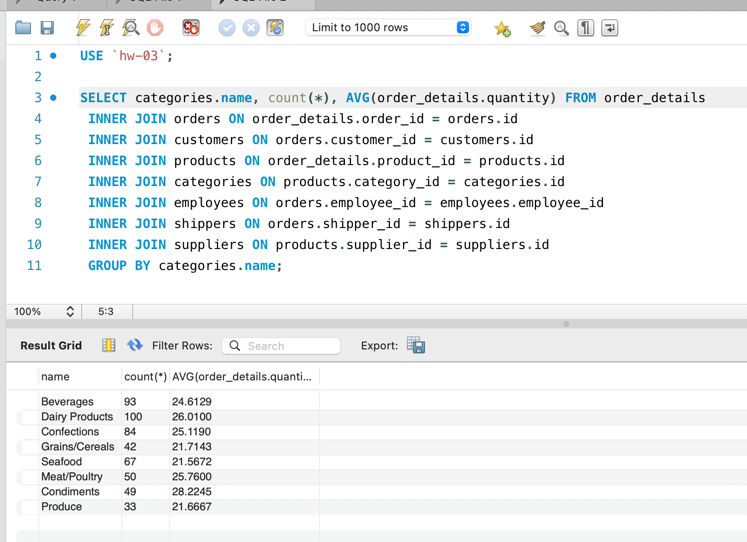
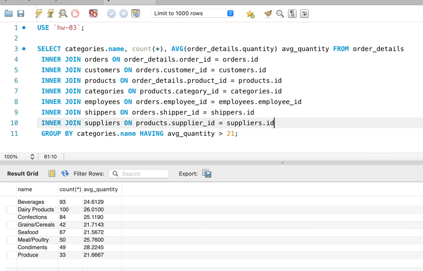
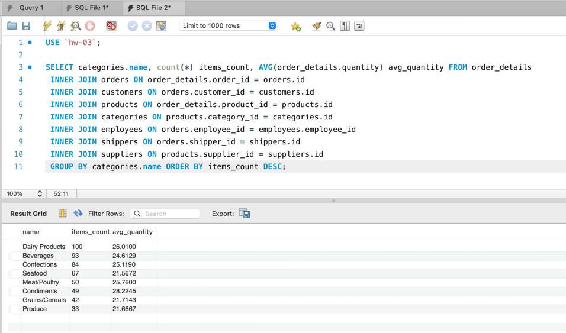
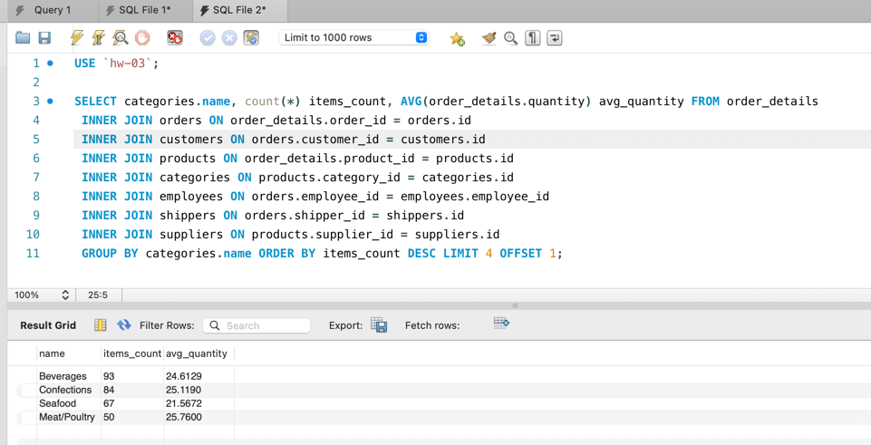

## Опис домашнього завдання та результати виконання

1. Створіть базу даних для керування бібліотекою книг згідно зі структурою, наведеною нижче. Використовуйте DDL-команди для створення необхідних таблиць та їх зв'язків.

#### Структура БД

a) Назва схеми — “LibraryManagement”

b) Таблиця "authors":

- author_id (INT, автоматично зростаючий PRIMARY KEY)
- author_name (VARCHAR)

c) Таблиця "genres":

- genre_id (INT, автоматично зростаючий PRIMARY KEY)
- genre_name (VARCHAR)

d) Таблиця "books":

- book_id (INT, автоматично зростаючий PRIMARY KEY)
- title (VARCHAR)
- publication_year (YEAR)
- author_id (INT, FOREIGN KEY зв'язок з "Authors")
- genre_id (INT, FOREIGN KEY зв'язок з "Genres")

e) Таблиця "users":

- user_id (INT, автоматично зростаючий PRIMARY KEY)
- username (VARCHAR)
- email (VARCHAR)

f) Таблиця "borrowed_books":

- borrow_id (INT, автоматично зростаючий PRIMARY KEY)
- book_id (INT, FOREIGN KEY зв'язок з "Books")
- user_id (INT, FOREIGN KEY зв'язок з "Users")
- borrow_date (DATE)
- return_date (DATE)

2. Заповніть таблиці простими видуманими тестовими даними. Достатньо одного-двох рядків у кожну таблицю.
   

3. Перейдіть до бази даних, з якою працювали у темі 3. Напишіть запит за допомогою операторів FROM та INNER JOIN, що об’єднує всі таблиці даних, які ми завантажили з файлів: order_details, orders, customers, products, categories, employees, shippers, suppliers. Для цього ви маєте знайти спільні ключі. Перевірте правильність виконання запиту.
   

4. Виконайте запити, перелічені нижче.

- Визначте, скільки рядків ви отримали (за допомогою оператора COUNT).
  
- Змініть декілька операторів INNER на LEFT чи RIGHT.
  
- Визначте, що відбувається з кількістю рядків. Чому? Напишіть відповідь у текстовому файлі.
  > Зміна операторів INNER JOIN на LEFT JOIN чи RIGHT JOIN може призвести до зміни кількості рядків у результаті запиту. Ось які можливі наслідки цього:
  > - INNER JOIN повертає тільки ті рядки, які мають відповідний запис у кожній з об'єднаних таблиць. Якщо які-небудь з об'єднаних таблиць не мають відповідних записів, ці рядки будуть відсутні у результаті.
  > - LEFT JOIN повертає всі рядки з лівої таблиці (першої в об'єднанні) і відповідні рядки з правої таблиці. Якщо в правій таблиці немає відповідного запису, використовується NULL.
  > - RIGHT JOIN повертає всі рядки з правої таблиці (другої в об'єднанні) і відповідні рядки з лівої таблиці. Якщо в лівій таблиці немає відповідного запису, використовується NULL.
- Оберіть тільки ті рядки, де employee_id > 3 та ≤ 10.
  
- Згрупуйте за іменем категорії, порахуйте кількість рядків у групі, середню кількість товару (кількість товару знаходиться в order_details.quantity)
  
- Відфільтруйте рядки, де середня кількість товару більша за 21.
  
- Відсортуйте рядки за спаданням кількості рядків.
  
- Виведіть на екран (оберіть) чотири рядки з пропущеним першим рядком.
  

